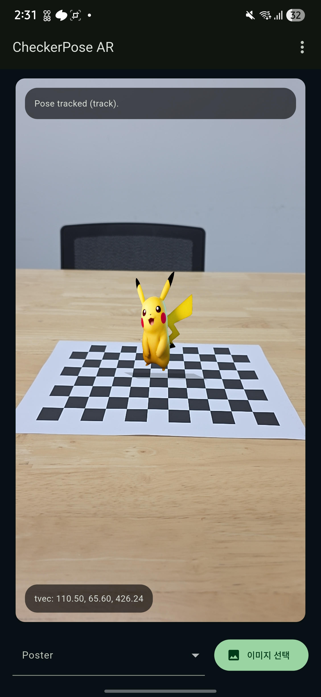

[한국어 README 보기](./README_kr.md)

# CheckerPose AR

CheckerPose AR is an Android app that estimates camera pose from a chessboard pattern and places a custom AR poster on top of the live camera view.  
The app combines Flutter for the UI, Chaquopy for the Android-Python bridge, and OpenCV for calibration, pose estimation, and tracking.

## Demo

### Screenshot



### Video

Download the demo video here: [example_video.mp4](example/example_video.mp4)

## Example Assets

- Demo screenshot: [example/example_picture.jpg](example/example_picture.jpg)
- Demo video: [example/example_video.mp4](example/example_video.mp4)
- Example calibration result: [example/calibration_example.json](example/calibration_example.json)

Note: the JSON file under `example/` is only a repository example.  
On an actual Android device, the calibration result is stored on the phone at:

`/storage/emulated/0/Android/data/com.example.checkerpose_ar/files/Pictures/checkerboard_calibration/calibration.json`

## Overview

This project performs two main tasks:

1. Camera calibration using multiple chessboard images
2. Real-time camera pose estimation and AR object rendering

Instead of drawing the default example object, this app renders a vertical image billboard/poster in perspective.  
The user can switch between built-in poster images and also load a custom image from the gallery.

## Main Features

- Camera calibration from chessboard samples
- Persistent calibration loading from saved `calibration.json`
- Sample image saving under the app's pictures directory
- Preview and replacement of calibration samples one by one
- Real-time pose estimation using `solvePnP`
- AR billboard rendering with perspective transform
- Custom poster image / animated image support
- Hybrid runtime tracking:
  full detection, optical-flow corner tracking, ROI-based re-detection

## How It Works

### 1. Calibration

The app collects chessboard images and runs OpenCV camera calibration to estimate:

- intrinsic camera matrix `K`
- distortion coefficients `dist`

The result is saved to `calibration.json` and loaded automatically on the next launch if it matches the current camera.

### 2. Pose Estimation

For each incoming camera frame, the app estimates the camera pose relative to the chessboard.

The runtime pipeline is:

1. Detect the chessboard corners
2. Track the corners between frames using optical flow
3. Re-detect inside a local ROI when tracking quality drops
4. Compute pose with `cv.solvePnP`
5. Project a vertical AR plane with `cv.projectPoints`

This hybrid approach improves tracking responsiveness compared with performing full chessboard detection from scratch on every frame.

### 3. AR Object Rendering

The AR object in this project is a vertical poster-like plane standing on the chessboard.  
Flutter receives the projected 2D quad from Python and renders the image using a perspective transform in a `CustomPainter`.

## Tech Stack

- Flutter
- Dart
- Android
- Chaquopy
- Python 3.10
- OpenCV
- NumPy

## Project Structure

- `lib/main.dart`
  main Flutter UI, camera preview, calibration screen, sample management, and AR flow
- `lib/ar_painter.dart`
  perspective rendering of the poster image onto the projected quad
- `android/app/src/main/kotlin/com/example/checkerpose_ar/PythonBridge.kt`
  Android bridge between Flutter and Python
- `android/app/src/main/python/open_cv_bridge.py`
  calibration, pose estimation, corner tracking, and ROI re-detection logic
- `reference/camera_calibration.py`
  reference calibration workflow
- `reference/pose_estimation_chessboard.py`
  reference pose estimation workflow

## Core Code Summary

- `reference/camera_calibration.py`
  provides the baseline OpenCV chessboard calibration flow:
  detect corners, refine with `cornerSubPix`, then estimate `K` and `dist` with `calibrateCamera`
- `reference/pose_estimation_chessboard.py`
  provides the baseline pose-estimation flow:
  detect chessboard corners, solve pose with `solvePnP`, and project 3D points back with `projectPoints`
- `android/app/src/main/python/open_cv_bridge.py`
  is the main implementation adapted from those references for the app runtime
  it keeps the same calibration and pose-estimation core, then adds hybrid tracking with optical flow and ROI-based re-detection for faster real-time updates
- `android/app/src/main/kotlin/com/example/checkerpose_ar/PythonBridge.kt`
  is the Android bridge which passes Flutter camera/calibration data into Python and returns the result maps back to Flutter
- `lib/main.dart`
  controls the app flow:
  collect calibration images, run Python calibration, request per-frame pose estimation, and pass the projected quad into the renderer
- `lib/ar_painter.dart`
  is the rendering core:
  it takes the 2D quad returned by Python and warps the poster image onto that quad with a perspective transform

## Running the App

### Requirements

- Flutter SDK installed
- Android device or emulator
- Local Python 3.10 installed for Chaquopy build

### Run

```bash
flutter pub get
flutter run
```

## Calibration Workflow

1. Open the calibration screen
2. Capture chessboard samples from different distances and angles
3. Review the saved samples
4. Replace bad samples individually if needed
5. Run calibration
6. Return to the main screen and start AR pose tracking

## Notes

- The calibration result is stored locally as `calibration.json`.
- Calibration sample images are stored in the app's pictures directory under `checkerboard_calibration`.
- On-device save path example:
  `/storage/emulated/0/Android/data/com.example.checkerpose_ar/files/Pictures/checkerboard_calibration/calibration.json`
- The app is currently designed for Android because the Python/OpenCV pipeline is connected through Chaquopy.
